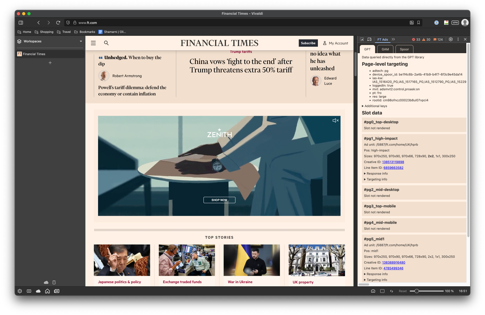

# FT Ads



## Overview

FT Ads is a Chrome extension intended to give users at-a-glance access to ads-related traffic properties.

## Features

### Inspect slot config

- See information about the page-level and slot-level targeting
- Click directly through to line items and creatives in GAM
- See the sizes a slot is configured to support, as well as the size it actually rendered at

### Inspect Ad Server requests

The query params of requests to the Ad Server are parsed and pretty-printed for easier reading.

### Inspect Spoor Traffic

The body of POST requests with the query strings `type=ads:slot-requested` and `type=ads:slot-rendered` are parsed and pretty-printed for easier reading.

The unedited raw data is viewable in the disclosure element at the foot of each column

## Installation from ZIP

1. Visit https://github.com/oliverturner/ft-ads-extension and click into the `.output` directory. Click the zip file it contains to download it.
2. Unpack the zip file and move the resulting directory into a location of your choice.
3. Open Chrome's Manage Extensions page by copying and pasting `chrome://extensions` into a new Chrome tab
4. Enable "Developer mode"
5. Click "Load unpacked", navigate to the unzipped folder and click "Select"


With these steps taken you should now see the extension show up:


### Updating

1. Delete the existing extension folder
1. Follow steps 1 to 3 above
1. Click the refresh icon


## Usage

With the extension installed...

1. Navigate to a page on FT.com and open the dev tools
1. Select the FT Ads tab, refresh the page, and scroll: you should see the results start to show up as below


## Development

To start the project, run:

```sh
npm run dev
```

This opens a Chrome window with the extension pre-installed and navigates to ft.com.

Open the web inspector and select the tab labeled "FT Ads" to see slot information

## Release [WIP]

This extension is yet to be published on the Chrome Store.

<!--
### Once publication has been set up...

1.
    ```sh
    npm run build
    ```
1. _Further details to come_
-->

## TODO

- [ ] Playwright tests
- [ ] More compact layout
- [ ] Support for OAds
