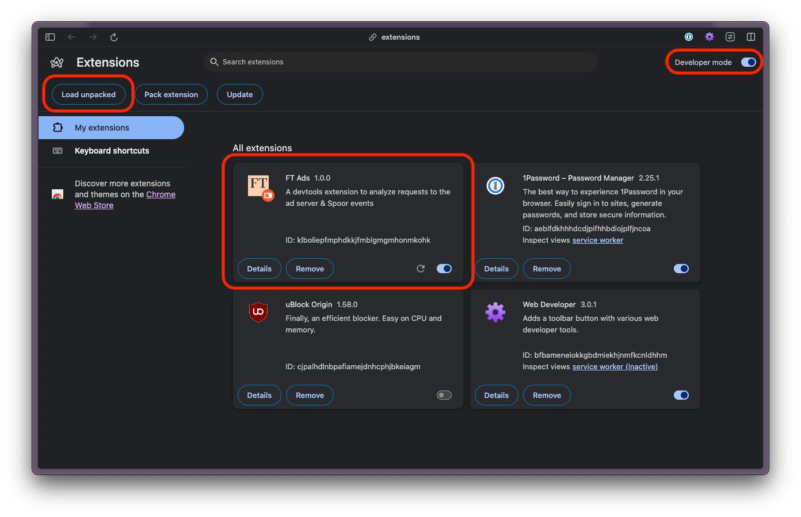

# FT Ads

## Overview

FT Ads is a Chrome extension intended to give users at-a-glance access to ads-related traffic properties.

Both Multi- (OAds) and Single Request Architectures (PG) are supported.

## Features

### Inspect Ad Server requests

The query params of requests to the Ad Server are parsed and pretty-printed for easier reading.

### Inspect Spoor Traffic

The body of POST requests with the query strings `type=ads:slot-requested` and `type=ads:slot-rendered` are parsed and pretty-printed for easier reading.

The unedited raw data is viewable in the disclosure element at the foot of each column

## Installation from ZIP

1. Download https://github.com/oliverturner/ft-ads-extension/archive/refs/heads/main.zip
2. Unpack the zip file and move the resulting directory into a location of your choice. Note that it contains a folder named `/dist`
3. Open Chrome's Manage Extensions page by copying and pasting `chrome://extensions` into a new Chrome tab
4. Enable "Developer mode"
5. Click "Load unpacked", navigate to the `/dist` folder and click "Select"


With these steps taken you should now see the extension show up:



## Usage

With the extension installed...

1. Navigate to a page on FT.com and open the dev tools
1. Select the FT Ads tab, refresh the page, and scroll: you should see the results start to show up as below


## Development

To start the project, run:

```sh
npm start
```

This will launch the panel as a hot-reloading HTML page pre-loaded with sample data, allowing you to quickly tweak and refine the UI and behaviour

To see the extension in action you will need to install it:

1. Run `npm run dev` to generate the `/dist` folder containing the compiled assets comprising the extension
1. Follow the [installation instructions](#installation-from-zip) from step 3 forwards

## Release [WIP]

This extension is yet to be published on the Chrome Store.

<!--
### Once publication has been set up...

1.
    ```sh
    npm run build
    ```
1. _Further details to come_
-->

## TODO

- [ ] Playwright tests
- [ ] More compact layout
- [ ] Better parity with [Google Publisher Console](https://developers.google.com/publisher-tag/guides/publisher-console): link out to
  - Line item
  - Creative detail
  - Delivery diagnostics
